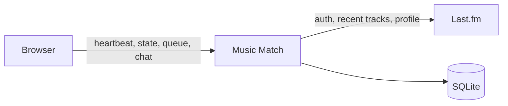

# Music Match design

Music Match is a web app that pairs two people who are listening to the same song at the same moment. Last.fm is the source of identity and of what each person is playing. The first version is one Next.js app with a SQLite database. The browser talks only to Music Match. Music Match is the only component that talks to Last.fm.

## Experience

### Sign in

The only entry is "Continue with Last.fm." The server starts Last.fm's approval flow (`auth.getToken`, then the Last.fm authorize page, then `auth.getSession` on the callback). The Last.fm session key is stored in SQLite. The browser receives an httpOnly Music Match session cookie. Opening the site later with that cookie returns the person straight to the app.

If Last.fm approval is declined, or the callback has no token, the person stays on the sign-in screen with a short explanation. If Last.fm later rejects the saved session, Music Match deletes it and shows sign-in again.

### Home

While the tab is open, Home shows the track Last.fm marks as now playing: artwork, title, and artist. Under that are up to five recent artists. "Find a match" is enabled only when a track is now playing and the person is not already in a match.

Recent artists are the first five distinct artists in `user.getRecentTracks` (limit 50), in order from newest to oldest. The current track's artist is included when it appears there. The same list is the snapshot stored if this person is paired.

If Last.fm reports no now-playing track, Home says nothing is playing and the button stays off. A scrobbled track without the now-playing flag does not count. If recent tracks are private, Home says listening must be public on Last.fm and the button stays off.

### Waiting

"Find a match" puts the person in a queue for the current song. The screen shows that song and a cancel control. A second tap while the same queue row exists does nothing.

The song identity is the pair (normalized artist, normalized track). Album is ignored, so two releases of the same recording can meet. Each half of the key is Unicode NFKC, lowercased, trimmed, with internal whitespace collapsed to a single space. Punctuation and remaining accent characters stay, so "Don't Stop" and "Dont Stop" are different songs. The display title, artist, and artwork are the original Last.fm strings, not the normalized key.

The matchmaker pairs the two people who have been waiting longest on that song. Each person can be in only one match at a time.

The wait ends, and the queue row is removed, when any of these happen:

- The person cancels.
- The person logs out.
- The now-playing track changes, including a change to nothing playing.

They then see Home for whatever is playing. They tap "Find a match" again if they still want a pair. The browser tab being hidden also stops the heartbeat. After thirty seconds without a heartbeat they are no longer eligible to be paired. A now-playing cache older than sixty seconds makes them ineligible too. In both cases the queue row stays. A later heartbeat and a fresh Last.fm read of the same song make them eligible again. A fresh read that shows a different song, or nothing playing, ends the wait as a track change.

### Chat

A match shows the other person's Last.fm username, avatar, and profile link, the song both people matched on, and that person's recent-artist snapshot. Those fields are copied at the moment of pairing and do not change if either person moves to another song.

Messages are plain text. The trimmed message must be from 1 to 500 JavaScript characters. An empty message is refused. A message for a match that has ended, or for a match the sender is not part of, is refused.

Either person can leave. Leave marks the match ended for both, writes a pair record, and both see Home on their next state refresh. The pair record is mutual: those two accounts are not paired again. Refreshing or closing the tab does not end the match. Logging out does not end it either. The other person can leave.

If the partner's heartbeat is older than thirty seconds, the chat shows them as away. Messages sent while they are away stay in the match until they return.

A hidden tab pauses the heartbeat and the state poll. An open match stays open.

## Architecture

One Next.js (App Router) TypeScript app serves the page and the API. SQLite, through `better-sqlite3`, is the only database. No other hosted service is required.

Environment:

- `LASTFM_API_KEY`
- `LASTFM_API_SECRET`
- `SESSION_SECRET`
- `APP_URL` (used as the Last.fm callback base)

The session cookie stores a random session id. The id is looked up in SQLite. The cookie is httpOnly and `SameSite=Lax`. It is `Secure` when `APP_URL` is https. The session lasts 30 days from the last heartbeat, so using the app keeps it alive.

### Components

| Piece | Responsibility |
| --- | --- |
| Screen | One page. Every two seconds it reads state and renders sign-in, Home, Waiting, or Chat. |
| Sign-in | Runs the Last.fm approval flow, stores the Last.fm session key, and sets the Music Match cookie. |
| Now playing | Accepts heartbeats. Refreshes Last.fm for users seen in the last thirty seconds, at most once every fifteen seconds, and caches the result. |
| Matchmaker | On queue join, and on each state read while the caller is waiting, pairs the two longest-waiting eligible people on the same song. |
| Chat | Stores text messages and returns any message newer than the caller's cursor. |

### Timing

| Event | Interval |
| --- | --- |
| State poll | 2 seconds while the tab is visible |
| Heartbeat | 10 seconds while the tab is visible |
| Presence window | Heartbeat newer than 30 seconds counts as present |
| Last.fm refresh | At most once every 15 seconds per present user |
| Usable now-playing cache | A cached now-playing track may be treated as current for 60 seconds when Last.fm cannot be reached. Older than that, Find a match stays off |
| Profile cache | `user.getInfo` (avatar and profile URL) refreshes at sign-in and at most once an hour after that |

Last.fm calls used: `auth.getToken`, `auth.getSession`, `user.getRecentTracks`, `user.getInfo`. Recent artists come from the recent-tracks response. There is no separate artists request.

### Data

**users.** Music Match user id, Last.fm username, Last.fm session key, avatar URL, profile URL, profile fetched time, created time, last heartbeat time.

**sessions.** Random session id, user id, expiry.

**now_playing.** One row per user: artist, track, album, artwork URL, now-playing flag, song key, recent artists as JSON, fetched time.

**queue.** At most one row per user: song key, display artist, display track, artwork URL, time joined.

**matches.** Id, song key, display artist, display track, artwork URL, user A, user B, snapshot A, snapshot B, status (`active` or `ended`), user who ended it, created time, ended time. A snapshot holds Last.fm username, avatar URL, profile URL, and up to five recent artists.

**messages.** Id, match id, sender id, body, created time.

**pairs.** The two user ids in ascending order, unique. Written when a match ends. The matchmaker never pairs two users who have a row here.

A user appears in at most one match with status `active`. The matchmaker enforces that inside the same transaction that creates the match and deletes both queue rows.

### Matchmaker rules

A waiting user is eligible when all of the following are true:

- Their heartbeat is newer than thirty seconds.
- Their cached now-playing flag is true, the song key equals the queue song key, and the cache was fetched within the last sixty seconds.
- They are not in an active match.

When someone joins, and whenever a waiting user reads state, the matchmaker loads eligible waiters for that song key, drops any pair that already has a pair-record, and creates one match from the two earliest `joined_at` values. If those timestamps are equal, the lower user id is treated as having waited longer. If the only eligible people are already in a pair-record together, they stay in the queue. If a third eligible person is waiting, either of the previously paired people can match with that third person.

Two joins that arrive together still produce one match. The transaction re-checks that both users are still waiting and that neither has an active match.

"Find a match" while already in an active match does not create a queue row. The next state read stays on Chat.

### HTTP surface

| Method and path | Behavior |
| --- | --- |
| `POST /api/auth/lastfm` | Starts approval and redirects to Last.fm. |
| `GET /api/auth/callback` | Exchanges the token, stores the session, sets the cookie, redirects home. |
| `POST /api/auth/logout` | Deletes the Music Match session and the caller's queue row. Does not end an active match. |
| `POST /api/presence` | Records a heartbeat and triggers a Last.fm refresh when the cache is older than fifteen seconds. |
| `GET /api/state` | Returns the view (`signed_out`, `home`, `waiting`, or `chat`), now playing, recent artists, queue info, match header, partner away flag, and messages after an optional cursor. Runs the matchmaker when the caller is waiting. |
| `POST /api/queue` | Joins the queue for the current now-playing song. Idempotent while that queue row exists. |
| `DELETE /api/queue` | Cancels the wait. |
| `POST /api/match/leave` | Ends the caller's active match and writes the pair record. |
| `POST /api/messages` | Adds a text message to the caller's active match. |

State responses include a short error string when Last.fm is stale, recent tracks are private, or the Last.fm session is no longer valid. The sign-in screen is the response when the session is no longer valid.

## Failure behavior

- Last.fm unreachable or rate-limited: keep using a now-playing cache fetched within the last minute, and mark it as possibly stale. If the cache is older than a minute, or it has no now-playing flag, Find a match stays off.
- Private recent tracks: Home explains that listening must be public. Find a match stays off.
- Declined Last.fm approval: remain on sign-in with a short explanation.
- Rejected Last.fm session: clear it and return to sign-in.
- Track change while waiting: remove the queue row and show Home.
- Track change during chat: chat and the frozen header stay as they were.
- Partner's tab closed: match stays; show Away after thirty seconds without a heartbeat.
- Empty or over-long message, or a message for a match the sender is not in or that has ended: refuse the message.
- Logout during a wait: remove the queue row. Logout during chat: match stays until someone leaves.

## Tests

Automated tests use a temporary SQLite file and a fake Last.fm client.

- Song keys: case, surrounding and internal whitespace, NFKC, album ignored, punctuation preserved.
- Pairing: the longer wait wins; equal join times use the lower user id; a stale heartbeat is skipped; a track change removes eligibility; an existing pair-record is skipped; a third person can match with either member of an old pair; two joins at once create one match; a user cannot be in two active matches.
- Leave: both users' next state is Home, a pair record exists, and those two are not paired again.
- Messages: empty and 501-character bodies are refused; a message after leave is refused; a message from someone outside the match is refused.
- Logout removes a queue row and leaves an active match in place.

Last.fm is not called from these tests. One manual browser pass covers the four screens: sign in, nothing playing, find a match, get paired, send a message, leave, and confirm in a later attempt that those two accounts are not paired again. That pass uses two browsers and a Last.fm API key.

## Out of scope

WebSockets, native mobile apps, group rooms, more than one match at a time, images or links as rich cards inside chat, push notifications when the tab is closed, and ending a match because someone logged out or went idle.
